# 🎯 Customer Segmentation Using RFM Analysis (End-to-End Analytics Project)

## 📊 Python, Data Analytics & Tableau Project

---

## 🪄 Introduction

This project delivers a complete **end-to-end customer segmentation system** using the Online Retail dataset, transforming raw transactional data into meaningful customer insights using **RFM (Recency, Frequency, Monetary) analysis**.

It simulates a real-world retail analytics scenario, demonstrating how businesses can:

- Identify high-value customers
- Understand customer purchasing behavior
- Segment customers for targeted marketing
- Improve retention strategies
- Support data-driven decision-making

---

## 📊 Badges


---

## 🧭 Business Context

In modern e-commerce, understanding customer behavior is essential for growth and profitability.

Businesses must:

- Identify valuable customers
- Detect churn risk early
- Improve customer retention
- Optimize marketing strategies
- Increase lifetime value (CLV)

This project demonstrates how RFM analysis helps transform raw transactional data into **actionable business intelligence**.

---

## 🎯 Purpose of the Project

To build a complete analytics pipeline that:

- Cleans raw transactional data
- Engineers customer-level features
- Applies RFM scoring methodology
- Segments customers into behavioral groups
- Produces Tableau-ready datasets for visualization

---

## 📈 Expected Outcomes

- Cleaned and structured dataset
- Customer-level RFM dataset
- Behavioral customer segments
- Revenue contribution by segment
- Tableau dashboard for insights and storytelling

---

## ⚠️ Disclaimer

This dataset is used strictly for:

- Learning purposes
- Portfolio development
- Educational demonstration

It does not represent real customer identities.

---

## 📑 Table of Contents

- [Project Overview](#-project-overview)
- [Dataset Description](#-dataset-description)
- [Data Pipeline](#-data-pipeline)
- [RFM Methodology](#-rfm-methodology)
- [Customer Segmentation](#-customer-segmentation)
- [Key Insights](#-key-insights)
- [Dashboard Preview](#-dashboard-preview)
- [Tools & Technologies](#-tools--technologies)
- [Project Structure](#-project-structure)
- [Conclusion](#-conclusion)
- [Author](#-author)

---

## 🧭 Project Overview

This project transforms raw e-commerce transaction data into:

- Customer insights
- Behavioral segmentation
- Revenue contribution analysis
- Business intelligence dashboards

The focus is on **business value extraction, not just data processing**.

---

## 🗂️ Dataset Description

The dataset contains transactions from a UK-based online retailer.

Key features include:

- Invoice number
- Product stock code
- Description
- Quantity purchased
- Invoice date
- Unit price
- Customer ID
- Country

---

## 📄 Data Sources

### 🔹 Raw Data
👉 [Online Retail Dataset](https://archive.ics.uci.edu/dataset/352/online+retail)

### 🔹 Processed Data
- 👉 `data/cleaned/online_retail_clean.csv`
- 👉 `data/rfm/customer_rfm.csv`
- 👉 `data/final/customer_segments_final.csv`

---

## ⚙️ Data Pipeline

### 🔹 Data Cleaning
- Removed missing Customer IDs
- Removed cancelled transactions
- Removed duplicates
- Removed invalid quantities and prices

---

### 🔹 Feature Engineering
- Created Revenue column
- Aggregated data at customer level
- Built RFM metrics

---

## 📊 RFM Methodology

RFM stands for:

- **Recency** → How recently a customer purchased
- **Frequency** → How often they purchase
- **Monetary** → How much they spend

Each customer is scored from 1–5 for each metric to identify value segments.

---

## 👥 Customer Segmentation

Customers are grouped into behavioral segments:

- Champions
- Loyal Customers
- Potential Loyalists
- At Risk Customers
- Lost Customers

These segments help businesses personalize marketing strategies.

---

## 📸 Process Visualization

All project steps are documented visually in the `images/` folder.

### 🔹 Data Cleaning Process

#### 📸 Step 01
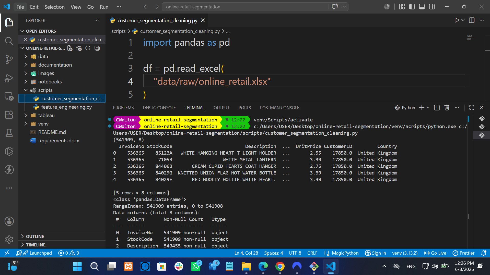

#### 📸 Step 02
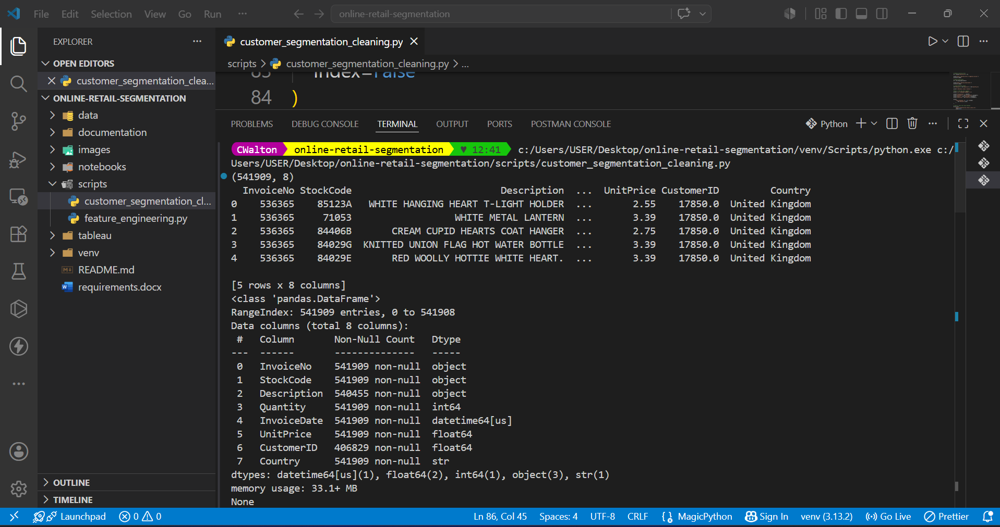

#### 📸 Step 03
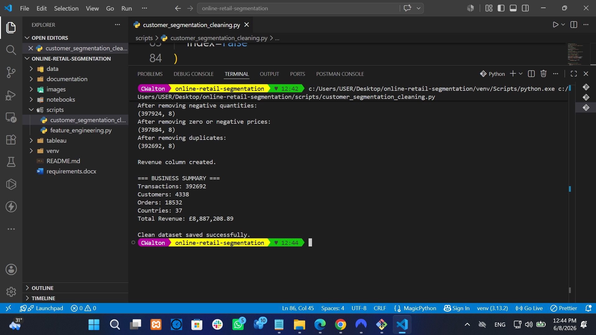

#### 📸 Step 04
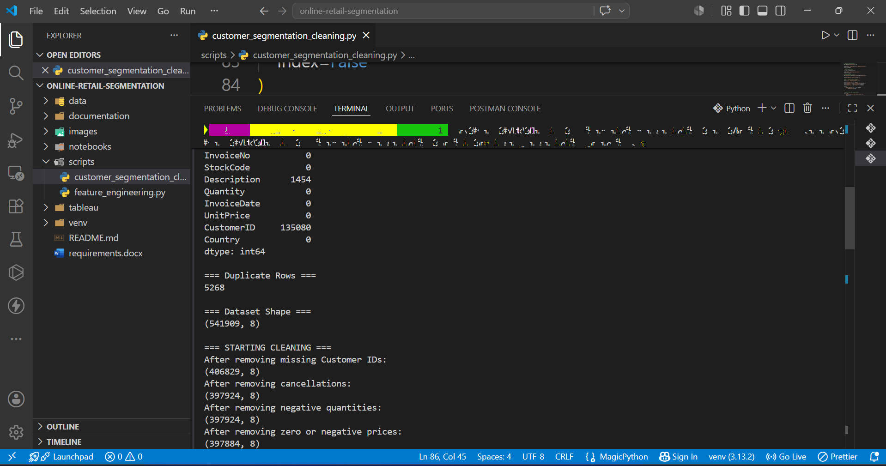

#### 📸 Step 05
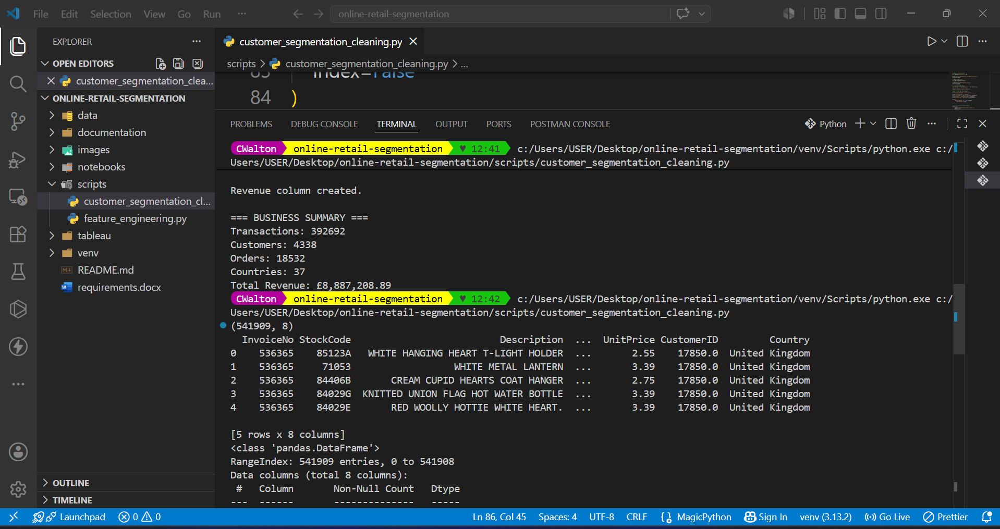

#### 📸 Step 06
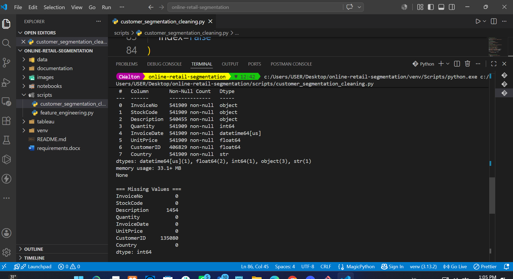

#### 📸 Step 07
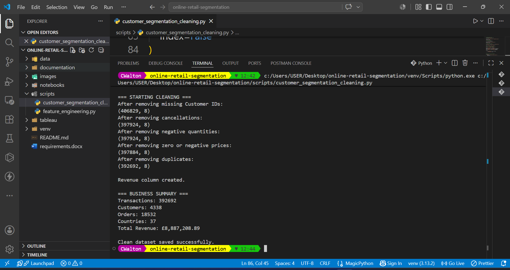

#### 📸 Step 08
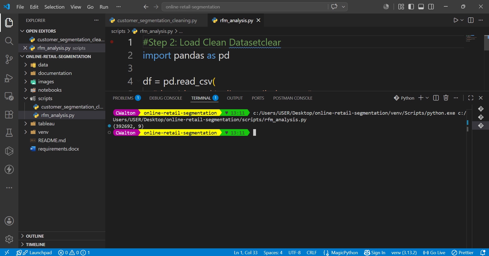

#### 📸 Step 09
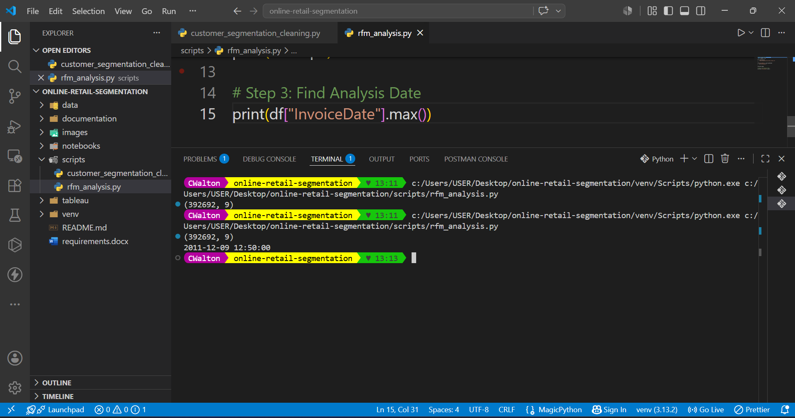

#### 📸 Step 10
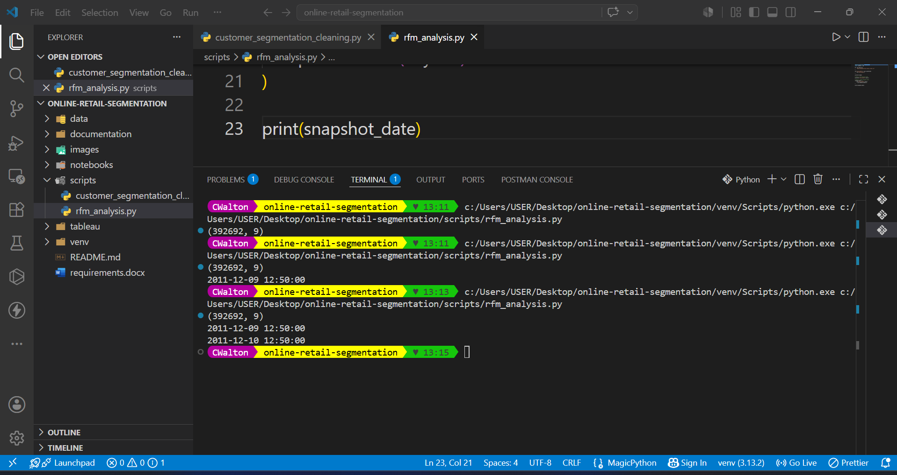

#### 📸 Step 11
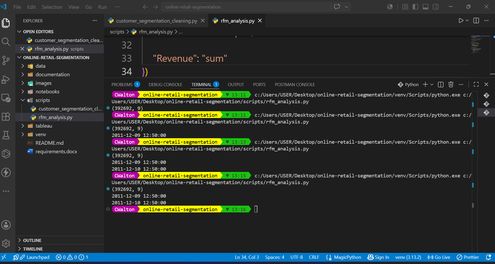

#### 📸 Step 12
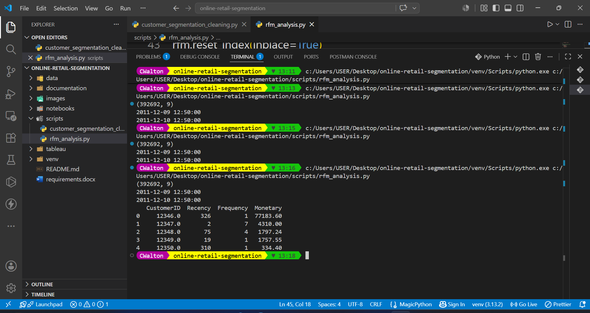

#### 📸 Step 13
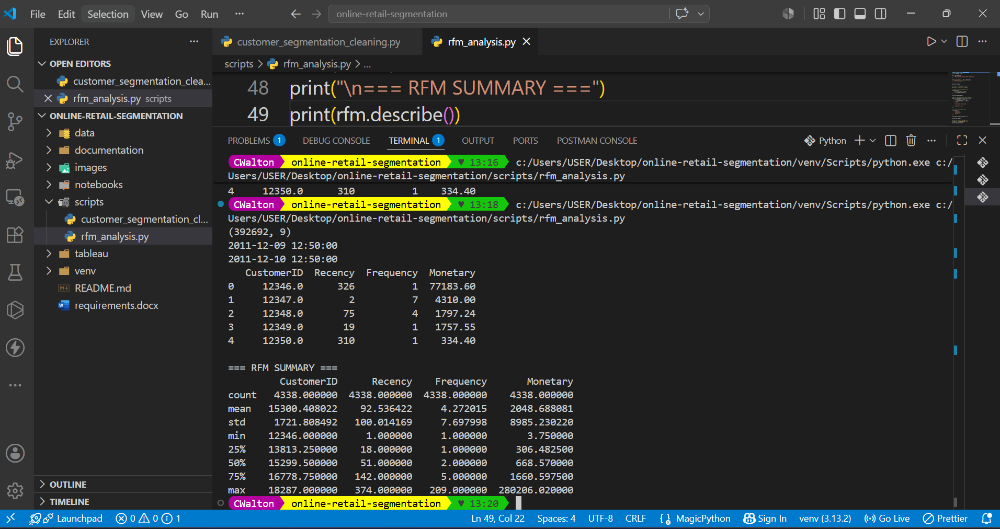

#### 📸 Step 14
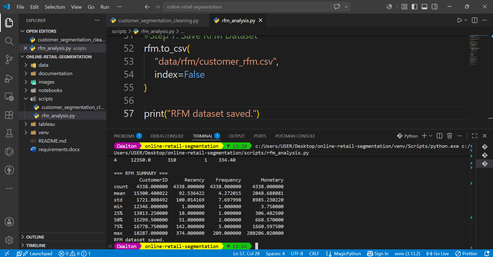

#### 📸 Step 15
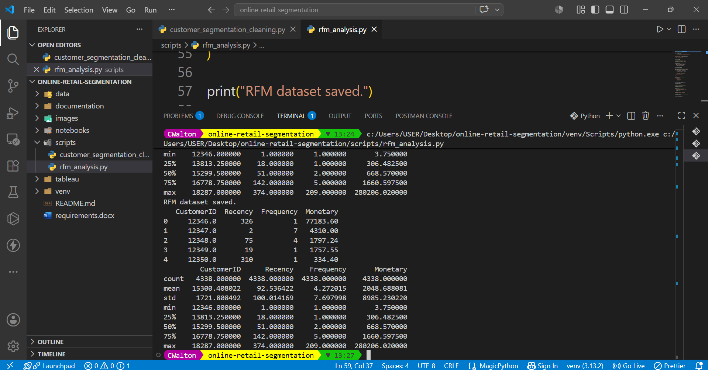

#### 📸 RFM Analysis Final Output
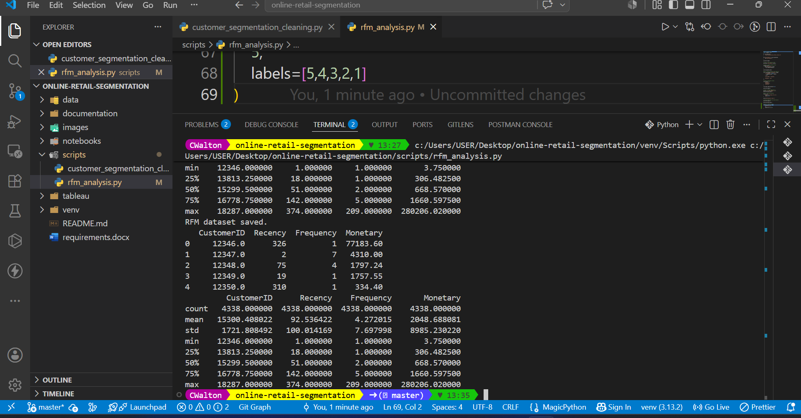

#### 📸 Customer Segmentation Results
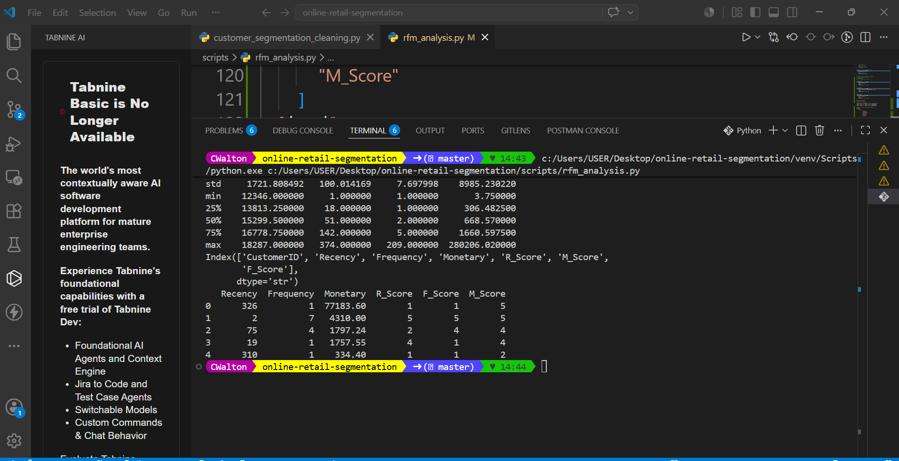

#### 📸 Revenue Insights
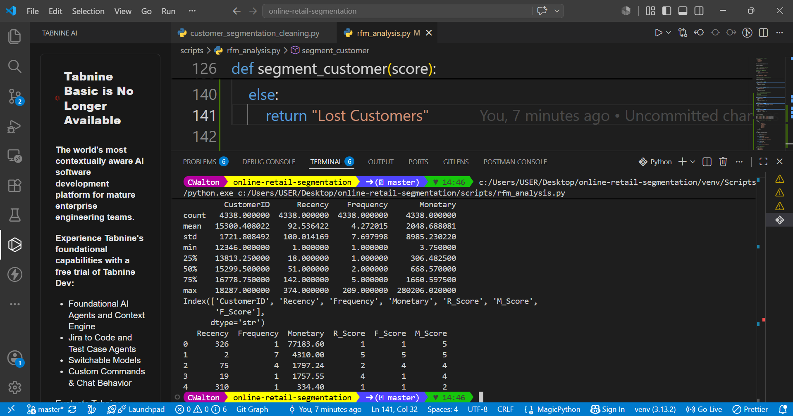

#### 📸 Tableau Dashboard Preview
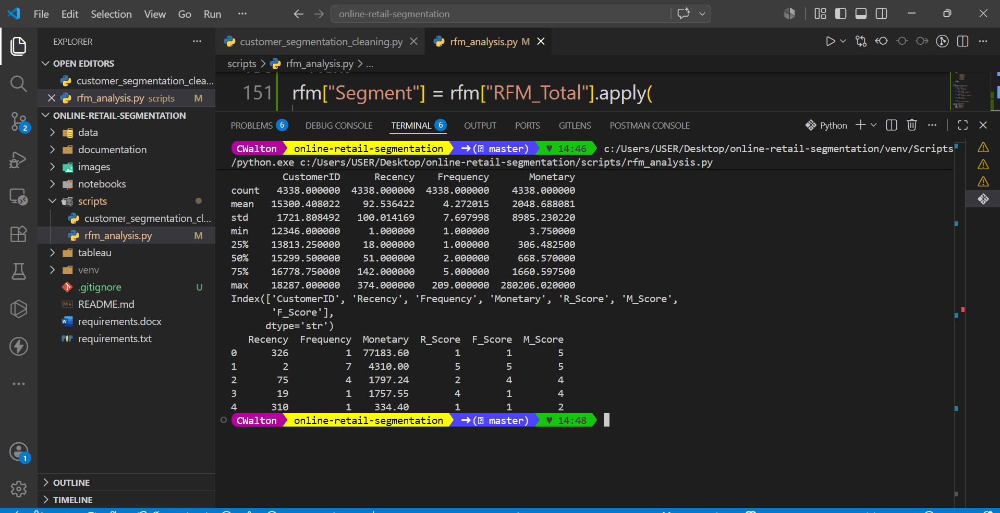

#### 📸 Final Storytelling View


---

## 💡 Key Insights

- A small group of **Champions drives the majority of revenue**
- Many customers fall into low-frequency purchase behavior
- Strong potential exists in **Potential Loyalist segment**
- Significant revenue is at risk from **At Risk customers**

---

## 📊 Dashboard Preview

The Tableau dashboard includes:

- Executive KPI Overview
- Customer Behavior Analysis
- RFM Distribution Charts
- Customer Segment Breakdown
- Revenue Contribution by Segment

---

## 🧰 Tools & Technologies

- Python (Pandas, NumPy)
- Tableau Public
- Jupyter Notebook / VS Code
- Git & GitHub

---

## 🏁 Conclusion

This project demonstrates how raw transactional data can be transformed into:

- Actionable business insights
- Customer segmentation strategy
- Data-driven marketing recommendations
- Tableau storytelling dashboard

It showcases a complete **end-to-end analytics workflow used in real business environments**.

---

## 📁 Project Structure

```text
online-retail-segmentation/
│
├── data/
│   ├── raw/
│   │   └── Online Retail.xlsx
│   ├── cleaned/
│   │   └── online_retail_clean.csv
│   ├── rfm/
│   │   └── customer_rfm.csv
│   ├── final/
│       └── customer_segments_final.csv
│
├── scripts/
│   ├── customer_segmentation_cleaning.py
│   ├── rfm_analysis.py
│
├── images/
│   ├── 01.png
│   ├── 02.png
│   ├── ...
│   └── 20.png
│
├── tableau/
│   └── dashboard.twbx
│
└── README.md


👩‍💻 Author

Charles Walton
Data Analyst | Python | SQL | Tableau | Business Intelligence
📧 cwalton1335@gmail.com